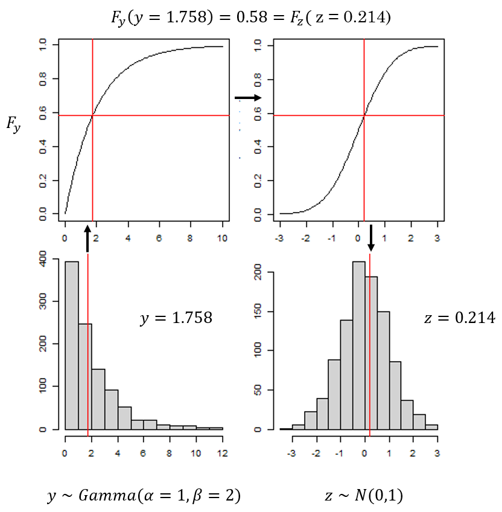
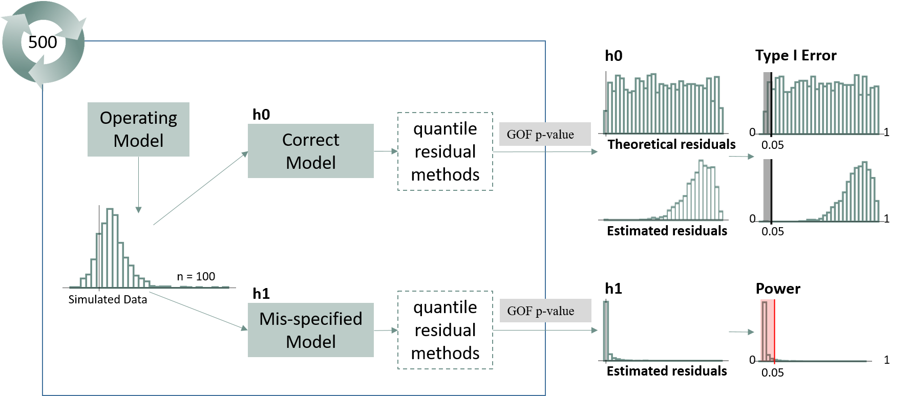
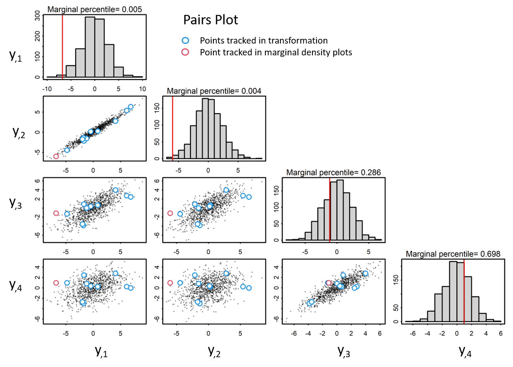
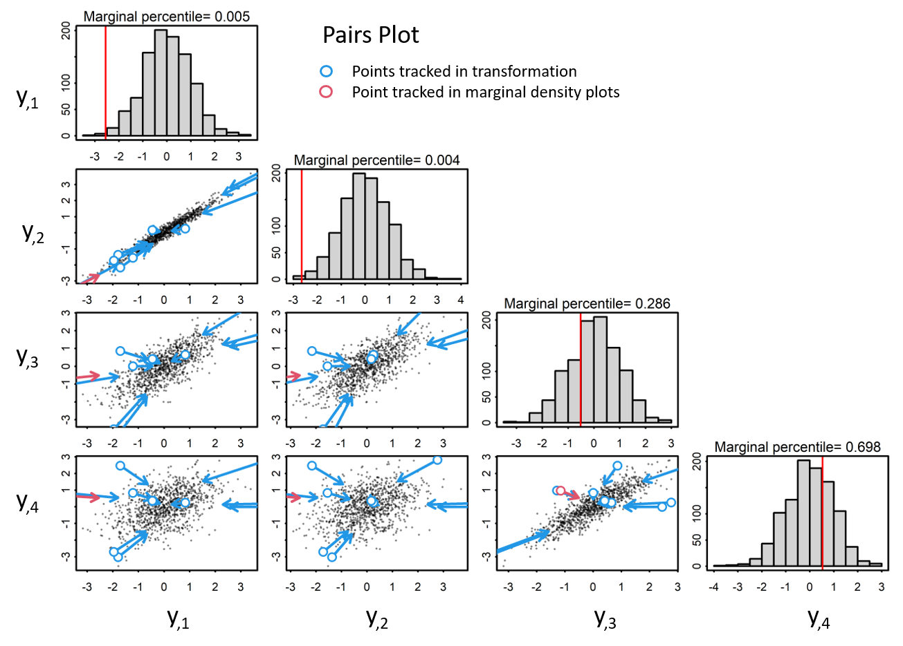
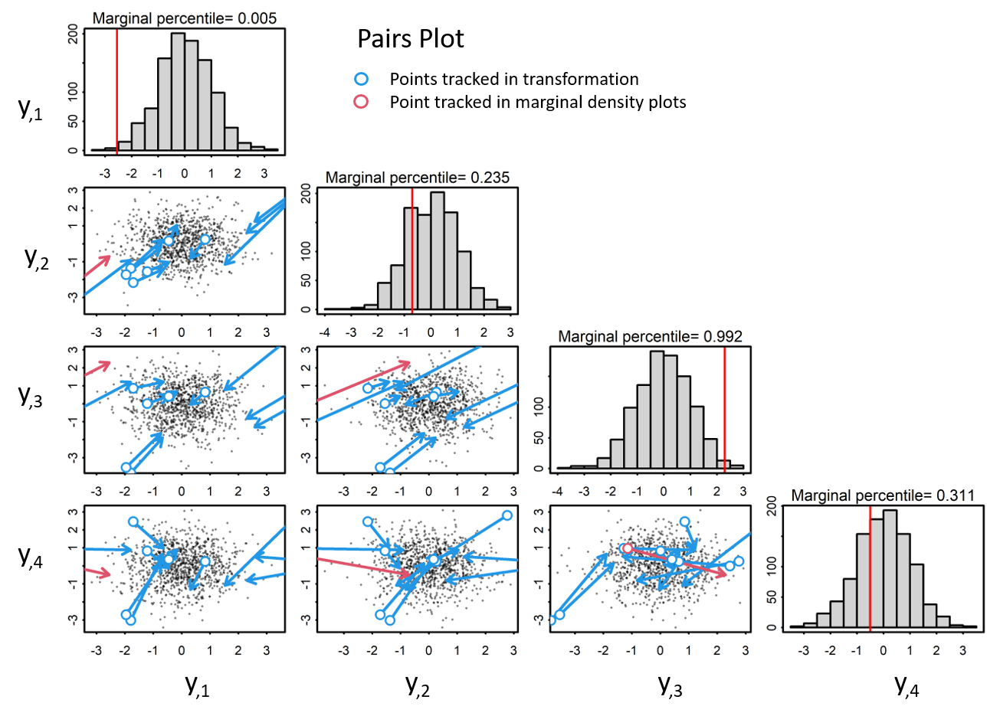

# Methods
```{r quant-res, echo=FALSE, fig.height = 4, fig.cap="Bottom left: An observation, y, plotted against its distribution, Gamma(alpha = 1, beta = 2). Top left: The cdf value of the observation y given the distribution parameters. Top right: The same cdf value plotted on a standard normal cdf curve. Bottom right: The inverse cdf of the value is plotted on a standard normal distribution."}

```

```{r studyoverview, echo=FALSE,  out.width = "100%", fig.cap = "Overview of Simulation Study. Data were first simulated under the Operating, or True Model. Data were then fit to two separate models: the same operating model and the mis-specified model. For each model fit, quantile residuals and subsequent GOF p-values were calculated for each method. This simulation was repeated 500 times and resulted in a distribution of p-values for each method under the correct and mis-specified model."}

```

```{r, include = FALSE, warning = FALSE, message = FALSE }
source("figs-tables/results-setup.R")
```

```{r pears-quant-comp, echo = FALSE, results = "hide"}
## IID =======================================================================
set.seed(123)
# Approx. normal gamma
y1 <- rgamma(1000, shape = 100, scale = .1)# mean=10; var=1
# Skewed gamma
y2 <- rgamma(1000, shape = .5, scale = 3)# mean=1.5; var = 4.5

output.iid <- function(y){
  hist(y)
  mu <- mean(y)
  sig2. <- var(y)
  pear.res <- (y-mu)/sqrt(sig2.)
  Fx <- pgamma(y, shape = mu^2/sig2., scale = sig2./mu)
  quant.res <- qnorm(Fx)
  pear.gof <- ks.test(pear.res, "pnorm")$p.value
  quant.gof <- ks.test(quant.res, "pnorm")$p.value
  (qqnorm(pear.res,
          main = "Pearson Normal Q-Q Plot",
          xlab = paste("Ks Test", round(pear.gof, 3))));abline(0,1, col = "red", lwd=1.5)
  (qqnorm(quant.res,
          main = "Quantile Normal Q-Q Plot",
          xlab = paste("Ks Test", round(quant.gof, 3))));abline(0,1, col = "red", lwd=1.5)
  
  
  return(invisible(y))
  
}
# iid
par(mfrow = c(2,3))
output.iid(y1)
output.iid(y2)

#Banded Correlation
set.seed(1)
C <- exp(-as.matrix(dist(seq(0,1,by=.1))))
L <- t(chol(C))
n.sim <- 500
eta <- t(rmvnorm(n.sim,sigma=C))

# Correlation in mean process
# Normal case
y7 <- eta
r7.nrot <- y7 #mean=0; sd=1, this is essentially the Pearson residual (y7-0)/1
r7.rot <- solve(L, y7)
gof.nrot <- ks.test(r7.nrot, "pnorm")$p.value
gof.rot <- ks.test(r7.rot, "pnorm")$p.value

par(mfrow = c(2,3))
boxplot(t(y7), horizontal=TRUE)
(qqnorm(r7.nrot,
        main = "Unrotated Normal Q-Q Plot",
        xlab = paste("Ks Test", round(gof.nrot, 3))));abline(0,1, col = "red", lwd=1.5)
(qqnorm(r7.rot,
        main = "Rotated Normal Q-Q Plot",
        xlab = paste("Ks Test", round(gof.rot, 3))));abline(0,1, col = "red", lwd=1.5)

# Gamma case
sig2 <- 1
y8 <- t(apply(exp(eta), 1:2, function(x) rgamma(1, x^2/sig2, scale = sig2/x )))
hist(y8)
moments::skewness(as.vector(y8)); moments::kurtosis(as.vector(y8))

#pgamma removes skewness and lowers kurtosis but returns zeros - cannot convert with qnorm, returns -Inf values
r8.unif <- apply(y8, 2, function(x) pgamma(x, mean(x)^2/var(x), scale = var(x)/mean(x)))
hist(r8.unif)
moments::skewness(as.vector(r8.unif)); moments::kurtosis(as.vector(r8.unif))

#rotating first removes correlation but retains kurtosis - cannot use pgamma because negative values
S <- cov(y8)
y8 <- t(y8)
L <- t(chol(S))
mode <- apply(y8, 1, function(x) x - mean(x))
r8.rot <- solve(L, y8)
hist(r8.rot)
moments::skewness(as.vector(r8.rot))
moments::kurtosis(as.vector(r8.rot))
```


```{r chol-demo-1, echo=FALSE, out.width = "90%", fig.cap="Given zero-centered multivariate data with a covariance matrix, Sigma. Pairs plo=ts visualize the correlation structure of the data. Blue and red indicate points tracked in transformation. The red points correspond with the marginal percentile in the histogram."}


```

```{r chol-demo-2, echo=FALSE, out.width = "90%", fig.cap="When observations are scaled to a unit variance, data are transformed to standardized normal space, yet correlation structure is retained."}


```

  
```{r chol-demo-3, echo=FALSE, out.width = "90%", fig.cap="In order to properly decorrelate the data, we need to apply a decoorelation method, such as the cholesky transformation. In this approach, we calculate the cholesky decomposition of the covariance matrix, Sigma, with which we use to transform the data to iid standardized normal space via both a scaling and a rotaion."}

```

\clearpage
\newpage

\input{"figs-tables/tables/linmod-specs.tex"}

\input{"figs-tables/tables/simpleGLMM-specs.tex"}

\input{"figs-tables/tables/randomwalk-specs.tex"}

\input{"figs-tables/tables/spatial-specs.tex"}

\clearpage
\newpage

# Results

## Simple Linear Model

```{r, linmod-results osa-true, echo = FALSE, message = FALSE, fig.cap = "Simple Linear Model. Distribution of theoretical p-values under the correct model evaluated for each analytical method when true parameters are known. **Take home: all analytical methods collapse to Pearson exactly when no random effects.**"}
osa.methods <- c(
   'full Gaussian',
   'one-step Gaussian',
   'one-step Generic',
   'cdf',
   'Pearson'
)
pval.df <- filter.true(pvals, "linmod", 
                       osa.methods)

plot.fun(pval.df, "osa", TRUE)
```

```{r, linmod-results osa-est, echo = FALSE, message = FALSE, fig.cap = "Simple Linear Model. Distribution of estimated p-values evaluated for each analytical method when parameters are estimated under the correct (top) and mis-specified (bottom) models. **Take home: all analytical methods collapse to approx. Pearson when no random effects.**"}
osa.methods <- c(
   'full Gaussian',
   'one-step Gaussian',
   'one-step Generic',
   'cdf',
   'Pearson'
)
pval.df <- filter.est(pvals, "linmod", 
                      osa.methods)

plot.fun(pval.df, "osa", FALSE)
```

```{r, linmod-results sim-true, echo = FALSE, message = FALSE, fig.cap = "Simple Linear Model. Distribution of theoretical p-values under the correct model evaluated for each simulation-based method when true parameters are known. **Take home: simulation-based methods approximately Pearson when no random effects.**"}

ecdf.methods <- c(
   "ecdf, Rotated",
   "ecdf, Not Rotated"
)
pval.df <- filter.true(pvals, "linmod", 
                       ecdf.methods)

plot.fun(pval.df, "sim", TRUE)
```

```{r, linmod-results sim-est, echo = FALSE, message = FALSE, fig.cap = "Simple Linear Model. Distribution of estimated p-values evaluated for each analytical method when parameters are estimated under the correct (top) and mis-specified (bottom) models. **Take home: simulation-based methods approximately Pearson when no random effects.**"}

ecdf.methods <- c(
   "ecdf, Rotated",
   "ecdf, Not Rotated"
)
pval.df <- filter.est(pvals, "linmod", 
                       ecdf.methods)

plot.fun(pval.df, "sim", FALSE)
```

\clearpage
\newpage
## Simple Mixed Model

```{r, simpleGLMM-results osa-true, echo = FALSE, message = FALSE, fig.cap = "Simple Mixed Model. Distribution of theoretical p-values under the correct model evaluated for each analytical method when true parameters are known. **Take home: all return approx uniform p-value distributions, regardless of mis-specification or of being linear or generalized linear, including Pearson.**"}
osa.methods <- c(
   'full Gaussian',
   'one-step Gaussian',
   'one-step Generic',
   'cdf',
   'MCMC',
   'Pearson'
)
pval.df <- filter.true(pvals, "simpleGLMM", 
                       osa.methods)

pval.df$misp <- factor(pval.df$misp,
                     levels = c("dropRE", "missnormcov", "missunifcov"),
                     labels = c("GLMM - Drop RE",
                                "LMM - Missing X Normal",
                                "LMM - Missing X Uniform"))

plot.fun(pval.df, "osa", TRUE)
```

```{r, simpleGLMM-results osa-est, echo = FALSE, message = FALSE, fig.height = 8, fig.cap = "Simple Mixed Model. Distribution of estimated p-values evaluated for each analytical method when parameters are estimated under the correct (top) and mis-specified (bottom) models. **Take home: Pearson is more highly skewd towards one than other methods. The power to detect the mis-specification of a missing normally distributed covariate in the Linear Mixed Model is lower than other mis-specifications.**"}
osa.methods <- c(
   'full Gaussian',
   'one-step Gaussian',
   'one-step Generic',
   'cdf',
   'MCMC',
   'Pearson'
)
pval.df <- filter.est(pvals, "simpleGLMM", 
                      osa.methods)

pval.df$misp <- factor(pval.df$misp,
                     levels = c("dropRE", "missnormcov", "missunifcov"),
                     labels = c("GLMM - Drop RE",
                                "LMM - Missing X Normal",
                                "LMM - Missing X Uniform"))

plot.fun(pval.df, "osa", FALSE)
```


```{r, simpleGLMM-results sim-true, echo = FALSE, message = FALSE, fig.cap = "Simple Mixed Model. Distribution of theoretical p-values under the correct model evaluated for each simulation-based method when true parameters are known. **Take home: Unconditional ecdf residuals fail to detect the correct model, regardless of mis-specification - is there an error here? Unrotated conditional ecdf resiudals are all approximately uniform.**"}

ecdf.methods <- c(
   "ecdf, Rotated", 
   "ecdf, Not Rotated"
)
pval.df <- filter.true(pvals, "simpleGLMM", 
                       ecdf.methods)

pval.df$misp <- factor(pval.df$misp,
                     levels = c("dropRE", "missnormcov", "missunifcov"),
                     labels = c("GLMM - Drop RE",
                                "LMM - Missing X Normal",
                                "LMM - Missing X Uniform"))

plot.fun(pval.df, "sim", TRUE)
```

```{r, simpleGLMM-results sim-est, echo = FALSE, message = FALSE,  fig.height = 8, fig.cap = "Simple Mixed Model. Distribution of estimated p-values evaluated for each analytical method when parameters are estimated under the correct (top) and mis-specified (bottom) models. **Take home: Unconditional ecdf residuals fail to detect the correct model, regardless of mis-specification - is there an error here? The power to detect the mis-specification of a missing normally distributed covariate in the rotated unconditional and unrotated conditional ecdf residuals is lower than other mis-specifications. The power to detect the mis-specification of a missing uniformally distributed covariate is also lower for the rotated unconditional ecdf residuals."}

ecdf.methods <- c(
   "ecdf, Rotated", 
   "ecdf, Not Rotated"
)
pval.df <- filter.est(pvals, "simpleGLMM", 
                       ecdf.methods)

pval.df$misp <- factor(pval.df$misp,
                     levels = c("dropRE", "missnormcov", "missunifcov"),
                     labels = c("GLMM - Drop RE",
                                "LMM - Missing X Normal",
                                "LMM - Missing X Uniform"))

plot.fun(pval.df, "sim", FALSE)
```


```{r, simpleGLMM-vary-nobs-TypeIError, echo = FALSE, message = FALSE, fig.height = 7, fig.cap = "Simple Linear Mixed Model, mispecification = missing normally distributed coviariate. Type I Error rates for different quantile residual methods as within group sample size increases, number of groups fixed at 4. **Take home: Rotated ecdf method has high Type I Error rate when within group sample sizes are high while unroated residuals maintain a low Type I Error rate.**"}
df <- pvals.all %>% dplyr::filter(model == "simpleGLMM.vary.nobs")
t1.err.plot(df)
```

```{r, simpleGLMM-vary-nobs-Power, echo = FALSE, message = FALSE, fig.height = 8, fig.cap = "Simple Linear Mixed Model, mispecification = missing normally distributed coviariate. Power to detect mis-specification for different quantile residual methods as within group sample size increases, number of groups fixed at 4. **Take home: The unrotated ecdf method applied to unconditional residuals has low power to detect mis-specification.**"}
df <- pvals.all %>% dplyr::filter(model == "simpleGLMM.vary.nobs")
pow.plot(df)
```


```{r, simpleGLMM-vary-ngroups-TypeIError, echo = FALSE, message = FALSE, fig.height = 7, fig.cap = "Simple Linear Mixed Model, mispecification = missing normally distributed coviariate. Type I Error rates for different quantile residual methods as betweem group sample size increases, number of observations within groups fixed at 8. **Take home: Results same as above with varying within group sample size.**"}
df <- pvals.all %>% dplyr::filter(model == "simpleGLMM.vary.ngrps")
t1.err.plot(df)
```

```{r, simpleGLMM-vary-ngroups-Power, echo = FALSE, message = FALSE, fig.height = 8, fig.cap = "Simple Linear Mixed Model, mispecification = missing normally distributed coviariate. Power to detect mis-specification for different quantile residual methods as betweem group sample size increases, number of observations within groups fixed at 8. **Take home: Results same as above with varying within group sample size.**"}
df <- pvals.all %>% dplyr::filter(model == "simpleGLMM.vary.ngrps")
pow.plot(df)
```

\clearpage
\newpage
## Randomwalk

```{r, rw-results osa-true, echo = FALSE, message = FALSE, fig.cap = "Randomwalk. Distribution of theoretical p-values under the correct model evaluated for each analytical method when true parameters are known. **Take home: all return approx uniform p-value distributions, including Pearson.**"}
osa.methods <- c(
   'full Gaussian',
   'one-step Gaussian',
   'one-step Generic',
   'cdf',
   'MCMC',
   'Pearson'
)
pval.df <- filter.true(pvals, "randomwalk", 
                       osa.methods)

plot.fun(pval.df, "osa", TRUE)
```

```{r, rw-results osa-est, echo = FALSE, message = FALSE, fig.cap = "Randomwalk. Distribution of estimated p-values evaluated for each analytical method when parameters are estimated under the correct (top) and mis-specified (bottom) models. **Take home: Pearson rejects the correct model more than expected, MCMC fails to detect mis-specification.**"}
osa.methods <- c(
   'full Gaussian',
   'one-step Gaussian',
   'one-step Generic',
   'cdf',
   'MCMC',
   'Pearson'
)
pval.df <- filter.est(pvals, "randomwalk", 
                      osa.methods)

plot.fun(pval.df, "osa", FALSE)
```

```{r, rw-results sim-true, echo = FALSE, message = FALSE, fig.cap = "Randomwalk. Distribution of theoretical p-values under the correct model evaluated for each simulation-based method when true parameters are known. **Take home: unconditional ecdf needs to be rotated but rotation does not matter when conditioning on random effects.**"}

ecdf.methods <- c(
   "ecdf, Rotated", 
   "ecdf, Not Rotated"
)
pval.df <- filter.true(pvals, "randomwalk", 
                       ecdf.methods)

plot.fun(pval.df, "sim", TRUE)
```

```{r, rw-results sim-est, echo = FALSE, message = FALSE, fig.cap = "Randomwalk. Distribution of estimated p-values evaluated for each analytical method when parameters are estimated under the correct (top) and mis-specified (bottom) models. **Take home: unconditional ecdf needs to be rotated but rotation does not matter when conditioning on random effects. Conditioning on estimated random effects results in rejecting the model more often than expected, regardless of rotation.**"}

ecdf.methods <- c(
   "ecdf, Rotated", 
   "ecdf, Not Rotated"
)
pval.df <- filter.est(pvals, "randomwalk", 
                       ecdf.methods)

plot.fun(pval.df, "sim", FALSE)
```


```{r, randomwalk-TypeIError, echo = FALSE, message = FALSE, fig.height = 7, fig.cap = "Randomwalk. Type I Error rates for different quantile residual methods as sample size increases. **Take home: MCMC has a high Type I Error rate when sample sizes are small. Rotated ecdf methods have lower Type I Error rates than unrotated ecdf methods, yet all have high error rates at large sample sizes.**"}
df <- pvals.all %>% dplyr::filter(model == "randomwalk")
t1.err.plot(df)
```

```{r, randomwalk-Power, echo = FALSE, message = FALSE, fig.height = 8, fig.cap = "Randomwalk. Power to detect mis-specification for different quantile residual methods. **Take home: MCMC has low power to detect mis-specification that does not improve with increased sample size. **"}
df <- pvals.all %>% dplyr::filter(model == "randomwalk")
pow.plot(df)
```

\clearpage
\newpage
## Spatial
```{r, spatial-results osa-true, echo = FALSE, message = FALSE, fig.cap = "Spatial Model. Distribution of theoretical p-values under the correct model evaluated for each analytical method when true parameters are known. **Take home: Pearson residuals reject the correct model at a high rate (high Type I error) when the model is a GLMM but reject the model at the expected rate when the model is a LMM**. "}
osa.methods <- c(
   'full Gaussian',
   'one-step Gaussian',
   'one-step Generic',
   'cdf',
   'MCMC',
   'Pearson'
)
pval.df <- filter.true(pvals, "spatial", 
                      osa.methods)

pval.df$misp <- factor(pval.df$misp,
                     levels = c("dropRE", "mispomega"),
                     labels = c("GLMM - Drop RE",
                                "LMM - Lognormal RE"))

plot.fun(pval.df, "osa", TRUE)
```

```{r, spatial-results osa-est, echo = FALSE, message = FALSE, fig.height = 8, fig.cap = "Spatial Model. Distribution of estimated p-values evaluated for each analytical method when parameters are estimated under the correct (top) and mis-specified (bottom) models. **Take home: Pearson residuals reject the correct model at a high rate (high Type I error) for both the GLMM and LMM. Power is slightly lower for dectecting the mis-specification of the LMM model where random effects were lognormally distributed**"}
osa.methods <- c(
   'full Gaussian',
   'one-step Gaussian',
   'one-step Generic',
   'cdf',
   'MCMC',
   'Pearson'
)
pval.df <- filter.est(pvals, "spatial", 
                      osa.methods)

pval.df$misp <- factor(pval.df$misp,
                     levels = c("dropRE", "mispomega"),
                     labels = c("GLMM - Drop RE",
                                "LMM - Lognormal RE"))

plot.fun(pval.df, "osa", FALSE)
```

```{r, spatial-results sim-true, echo = FALSE, message = FALSE, fig.cap = "Spatial Model. Distribution of theoretical p-values under the correct model evaluated for each simulation-based method when true parameters are known. **Take home: the unconditional ecdf residuals reject the correct model at a high rate (high Type I error) when the model is a GLMM, regardless of rotation. The rotation corrects the unconditional ecdf residuals when the model is a LMM. The rotated, conditional ecdf residuals reject the correct model more often than expected, while the unrotated residuals reject the correct model at approximately the expected rate. For the LMM, the rotation does not have an effect - both produce uniformally distributed residuals. This result suggests an error in the rotation when observations are not normal.** "}

ecdf.methods <- c(
   "ecdf, Rotated", 
   "ecdf, Not Rotated"
)
pval.df <- filter.true(pvals, "spatial", 
                      ecdf.methods)

pval.df$misp <- factor(pval.df$misp,
                     levels = c("dropRE", "mispomega"),
                     labels = c("GLMM - Drop RE",
                                "LMM - Lognormal RE"))

plot.fun(pval.df, "sim", TRUE)
```

```{r, spatial-results sim-est, echo = FALSE, message = FALSE,  fig.height = 8, fig.cap = "Spatial Model. Distribution of estimated p-values evaluated for each analytical method when parameters are estimated under the correct (top) and mis-specified (bottom) models. **Take home: For the GLMM model, both the conditional and unconditional ecdf methods reject the correct model more often than expected, regardless of rotation. For the LMM, the rotation corrects the unconditional ecdf residuals, but not the conditional ones. Power is slightly lower for dectecting the mis-specification of the LMM model where random effects are lognormally distributed.**"}

ecdf.methods <- c(
   "ecdf, Rotated", 
   "ecdf, Not Rotated"
)
pval.df <- filter.est(pvals, "spatial", 
                      ecdf.methods)

pval.df$misp <- factor(pval.df$misp,
                     levels = c("dropRE", "mispomega"),
                     labels = c("GLMM - Drop RE",
                                "LMM - Lognormal RE"))

plot.fun(pval.df, "sim", FALSE)
```

\clearpage
\newpage

## Model Runtimes
```{r runtimes-log-scale, echo = FALSE, message = FALSE}
runtimes.all$model <- 
  factor(runtimes.all$model,
         levels = c("simpleGLMM.vary.ngrps",
                    "simpleGLMM.vary.nobs",
                    "randomwalk",
                    "spatial"),
         labels = c("Simple LMM, vary no. groups",
                    "Simple LMM, vary no. obs",
                    "Randomwalk",
                    "Spatial"))
p <- runtimes.all %>% 
  ggplot(.,aes(nobs, med, ymin=lwr, ymax=upr,  color=method)) +
  geom_line()+ 
  facet_wrap(~model) +
  geom_pointrange(fatten=2) + scale_y_log10()+ scale_x_log10()+
  labs(y='runtime, log10(s)') +
  theme_bw() + 
  scale_color_jco()
p
```

```{r runtimes, echo = FALSE, message = FALSE}
p <- runtimes.all %>% 
  ggplot(.,aes(nobs, med, ymin=lwr, ymax=upr,  color=method)) +
  geom_line()+ 
  facet_wrap(~model) +
  geom_pointrange(fatten=2) + 
  labs(y='runtime, s') +
  theme_bw() + 
  scale_color_jco()
p
```